# Unity User Guide

## About

This is a combination of the [2D](https://github.com/Zeyu-Li/Unity-Tutorial-2D) and [3D](https://github.com/Zeyu-Li/Unity-Tutorial-3D) tutorial repos. I will go through 2D and 3D games along with general tips and tricks for solo and team-based projects. Without future ado, let's begin! 

<a name="top"></a>

## Index

1. [Installation](#install)
2. [General](#main)
3. [Unity Editor Overview](#unity)
4. [2D](#2D)
   1. [General](#2dg)
   2. [Sprites](#spr)
   3. [Movement](#move)
   4. [Camera](#camera)
      * [Background](#background)
      * [Camera Follow](#camera_follow)
   5. [Prefabs](#pref)
   6. [Particle System](#partsys)
   7. [Collectibles](#coll)
   8. [Animation](#anim)
   9. [Events](#events)
   10. [Pixelated](#pix)
   11. [Music & Sounds](#music)
   12. [Parallax](#par)
   13. [Odds and Ends](#odds)
       * [Linking Scenes](#linked_scenes)
       * [Death Zone](#death_zone)
       * [Enemies](#enemies)
       * [Pausing](#pausing)
       * [Quiting](#quit)
   14. [End Note](#end2d)
       * [End Product](#finished) (Demo)
5. [3D](#3D)
   1. [General](#5a)
   2. [3D Models & Bodies](#5b)
       * [Resources](#m_res)
       * [Software](#software)
       * [Libraries](#libraries)
       * [Unity](#m_unity)
   3. [Movement](#5c)
   4. [Camera](#5d)
   5. [Lighting](#light)
   6. [Prefabs](#5f)
   7. [Particle Systems](#5g)
   8. [Animation](#3anim)
   9. [Collectibles](#3coll)
   10. [Events](#3events)
   11. [Music & Sounds](#3music)
   12. [Odds and Ends](#3odds)
       * [Pausing](#3_pausing)
       * [Quiting](#3_exit)
   13. [Demo](#3demo)
6. [Title Screen](#3_title)
7. [Scripting](#script)
8. [Building](#build)
9. [Cloning Guide](#guide)
10. [Collaboration](#team)
    * [Unity's Collab](#unity) (recommended)
    * [GitHub](#git)
11. [Resources](#help)

<a name="install"></a>

### 1. Installation

Before installing, note that Unity is **completely free**, if you or your company makes less than $100 000 (USD). 

Follow the link [here](https://store.unity.com/download) and download the free installer (the plus version is definitely not necessary). Follow the instructions and download the installer. The Unity installer is simple and easy to use nevertheless, this [video](https://www.youtube.com/watch?v=KMuMhA6Lk0I) for Windows is a tutorial in installing it. Also note that you will may need a Unity account or just use your Google/Facebook account to sign in. 

If you want a new version of Unity, go to the Unity Hub and click the **Installs** tab on the left and **ADD** (top right) the desired version (it is recommended that you pick a version with **long term support** or LTS); however do be warned that this tutorial was made in **2019.3** so in newer versions, things might have moved places or removed entirely 😞. Afterwards, the installation will take quite a while, even with a fast internet connection. 

When installing Unity, it might ask you to install **Visual Studio** along-side Unity. If you have Visual Studio, do not install again, it should automatically detect the current VS on the system. Otherwise, it is optional and MonoDevelop (comes with Unity) is good enough for handling coding in Unity. 


<a name="main"></a>

### 2. General

**Unity** is a 3D game engine built in **C#** but can be used for 2D. Before you freak out about programming, let me assure, you it is quite trivial. If you have programmed before especially in C++, it is a huge plus. If you have not, don't worry, it's just a bunch of copy and pasting. The most important thing is don't be frustrated and 

```c#
Debug.Log() // logs to Unity console
```

is your friend. 

Being organized in Unity is a must, especially for big projects. Have organized folder will help a ton, in addition, using empties as folders within scene is *+1 organization*. 


<a name="unity"></a>

### 3. Unity Editor Overview

Unity is a panel based application. These panels can be rearranged however you like and saved as default. 


This is my default setup. The **Scene** panel is the most important viewport. This is where you modify the scene. The **Game** scene only turns on if you hit play. It is a preview of what the user will see if you build the current scene.

On the right hand side, we have the **Project** directory (folder) panel on the bottom. This is where all your assets are (ie art, music, scripts). The **Hierarchy** is like a layers panel in Photoshop. It is an arrangement of all elements in the scene. For every element of the scene can be hidden from the view by hitting eye button when hovering on the element. The lock button is the pointer icon. The **Inspector** contains all modifiable aspect of an element along with info. This is where you drag scripts in the element.

Other panels include a console, which will output when the game is run. The **Animator** and **Animation** go hand in hand and creates animation for sprites. 


<a name="2D"></a>

## 4. 2D

<a name="2dg"></a>

### 	4a General

So you've decide to make a 2D game. Great! Who needs modelling and lighting anyways? 

2D games are secretly 3D, what does that mean? Think of Unity 2D as a bunch of layers like in Photoshop, Gimp, After Effects, or Illustrator. The closest to the camera is picked up first and blocks the ones behind it. As a 2D world, lighting is global (unless you want enable an experimental local lighting feature). To start a new 2D game, click **New** and select 2D on the pop-up screen and use the desired directory (or follow my cloning [guide](#guide) so to not start from starch). This may take some time, but after Unity finishes installing itself, we can get started. Now let's make a player and make it move!

*Note, part of the tutorial (2D) follows this repo: [Unity-Tutorial-2D](https://github.com/Zeyu-Li/Unity-Template-2D-2019_3)


<a name="spr"></a>

### 	4b Sprites

Sprites are what make up the visuals of the game. These could be png or jpeg (recommended because of small size) file. You can make your own and drag them into an **Artworks folder**.

If you have multiple sprites on a picture file, you have what is called a **sprite sheet**. These could be useful because it saves space. Unity comes with a sprite editor that can cut the sprite sheet into multiple sprites. 

However, before we get to that, let us take a look at the Sprite setting


From the top header, we can see some info on the item

From the header we also see:

* Texture Type - Usually will only use sprite (2D image) or normal map (for 3D depth)
* Sprite mode - as single texture or sprite sheet
  * Adjust the pixels per unit (Pixels per unit should be 1-1) (In my case, it is 358 px per tile)
  * Pivot - where the center of object is
* Wrap Mode - how the image is displayed (ie repeated or clamped(/cut) at the board)
* Filter Mode - Point (equivalent to pixel perfect or nearest neighbour in Photoshop) or Bilinear (natural scaling with edge softening)
* Format - Format of image (8bit, 16 bit, 32 bit colour with or without alpha)

\* Note, if a setting was not mentioned, it is not that important at the beginner level.

**Multiple Sprites**

1. Select Multiple in **Sprite Mode**
2. Click **Spirit Editor** button
   
3. In sprite editor, click Slice -> Slice (This is an automatic slicer and is usually good enough, if not, manually move the transform bound boxes to fit or define split at distance apart (must change to **Grid by Size Count**, not **Automatic**) with the size of tile in **Pixel Size**.
4. Click apply
5. Close window or drag to some widget
6. You can inspect every tile by expanding the original image and a bunch of tiles with name pictureName_0 to # of tiles with be a child of it

Now, with a sprite, you can drag it into the scene

To create a tile map, follow the steps below:

1. GameObject -> 2D Object -> Tile Map
2. Open Tile Palette, by going to Window -> 2D -> Tile Palette
3. Create New Palette and save it
4. Drag all individual tiles into widget or drag parent spritesheet (and save)

Now with the tile palette, you can draw on the scene, reorganize everything and many other things


From the top, there are many icons, we will go through each of them,

* Curser - selects tiles from scene
* Move - Moves tiles in palette (Only if you click **Edit**)
* Brush - paints on scene
* Square/Rect - Selects multiple tiles or one to paint from
* Eye dropper - Selects tile from scene
* Eraser - Erases
* Paint Bucket - Floods with active brush (Like Photoshop)

To layer tiles:

* Right click on the tile map -> 2D -> Tilemap for however many more layers you need

To set a layer as a solid with collision:

1. go to the layer you want to make solid
2. Add Component -> search add Tilemap Collider 2D

Resources: [Brackeys](https://www.youtube.com/watch?v=ryISV_nH8qw)


<a name="move"></a>

### 4c Movement

Movement is critical in all games, whether the movement is limited to left or right, or games that in 3D. On the internet there are may sources that claim the perfect jump, but only you can decide that based on what type of gameplay you want. 

To start off with, set your player to be a rigid body with colliders:

1. Select the player and add a Rigidbody 2D

   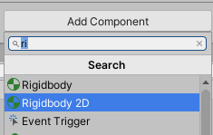
2. Open up the Rigidbody 2D and go to constraints. If you want the player to not rotate in 2D, then select **Freeze Rotation Z**
3. Otherwise, add a **Collider 2D** to fit the player. Depending on how your player's form, different shapes may be better. Try the different collider options to see which ones fit best. Most of the time, a **Box Collider 2D** will work just fine. Also note that you can use multiple colliders, but remember, this is computationally more expensive.
4. Also note that if you are not satisfied with Unity's default collider size, you can change the size by changing the **size** attribute

Now for the movement:

1. make a new folder called **scripts**
2. right click -> Create -> C# Script -> call it **movement** (although you can pick any name you want, this is standard)

Next, you want to open the script by double clicking on it

This will either open the script in MonoDevelop or Visual Studio (to find out more about scripting, go to the [scripting section](#script))

In the movement class, put

```c#
// inits
// hoziontal speed
public float speed = 10f;

// vertical jump
public float jumpForce = 10f;

// different jump heights for how long jump button is pressed
// change it as you change gravity
public float jumpCheck = .2f;
// is ground check
public float checkRadius = 0.3f;

// ground jump check
public bool isGrounded;
public Transform feetPos;
public LayerMask whatIsGround;

// so that infin jumps are not a thing
private float jumpCheckCounter;
private bool jumping;
private float moveInput;

// inits rigid body
private Rigidbody2D rb;

void Start() {
    rb = GetComponent<Rigidbody2D>();
}

void Update() {

    // bool to see if overlap of floor layer and feet object
    isGrounded = Physics2D.OverlapCircle(feetPos.position, checkRadius, whatIsGround);

    // if is touching ground and jump button pressed, add jump force
    if (Input.GetButtonDown("Jump") && isGrounded == true) {
        jumping = true;
        jumpCheckCounter = jumpCheck;
        rb.velocity = Vector2.up * jumpForce;
    }

    if (Input.GetButton("Jump") && jumping == true) {
        // can jump only once
        if (jumpCheckCounter > 0) {
            Debug.Log(jumpCheckCounter);
            rb.velocity = Vector2.up * jumpForce;
            jumpCheckCounter -= Time.deltaTime;
        }

    }
    else {
        // once jumping is not true, set jump to false
        jumping = false;
    }

    if (Input.GetButtonUp("Jump")) {
        jumping = false;
    }

    // flips player
    if (moveInput > 0) {
        transform.eulerAngles = new Vector3(0, 0, 0);
    }
    else if (moveInput < 0) {
        transform.eulerAngles = new Vector3(0, 180, 0);
    }
}
void FixedUpdate() {
    // gets horizontal input from Unity (1 = right, -1 = left)
    moveInput = Input.GetAxisRaw("Horizontal");
    rb.velocity = new Vector2(moveInput * speed, rb.velocity.y);
}
```

Save and exit. Now, when you click on the player, movement script, there will be options for you to tinker with. 

Finally for jumping you need to:

1. Set ground layer to ground objects that can be jumped on
2. Make a isGrounded empty object to be placed at the feet of the player to check if there is **ground layer **beneath the player to jump off of

\* Note that this script has a jump that can be a multitude of heights depending on how long the jump button is held down for.

Also, for the player to not stick to the walls while jumping, you must:

1. Add a new physics material 2D
2. Change friction to 0 and bounciness to whatever you want it to be 
3. Apply to player in the collider

Resource: https://www.youtube.com/watch?v=j111eKN8sJw


<a name="camera"></a>

### 	4d Camera

The camera will capture things on from the scene to project onto the play window. 

The most important setting for a camera object is the size. Changing the size will change the view for the user. 

<a name="background"></a>

**Background**

A background can be achieved by placed in the camera and setting the **Order in Layer** to some negative number, such that it is behind the foreground objects

<a name="camera_follow"></a>

**Camera Follow**

When implementing a camera, there are two options, however, we will through the harder option first to get use to how cameras work

1. We will create a camera follow script with the following:

   ```c#
   // selects targe to be fixed on
   public Transform target;
   public float smoothing = 0.12f;
   
   // because it is fixed to player, we want to move in from by 10 layers be default
   public Vector3 offset = new Vector3(0f,0f,-10f);
   
   void FixedUpdate() {
       Vector3 desiredP = target.position + offset;
   
       // interpolate movement
       Vector3 smoothP = Vector3.Lerp(transform.position, desiredP, smoothing);
       transform.position = smoothP;
   
       // will move in direction of target
       // comment out if you don't like the jitters
       transform.LookAt(target);
   }
   ```

   You will have to drag the player to target and change the smoothing value if you like more or less smoothing

   

   **OR**

   

2. Use the [Cinemachine Extension](https://assetstore.unity.com/packages/essentials/cinemachine-79898) 

To use Cinemachine, one must first install the extension as it does not come in with Unity natively. To do this, 

1. window -> Package Manager -> **Search: **Cinemachine -> click install

Now to use it:

1. Cinemachine -> Create 2D Camera
2. Embed CM vcam into main camera (optional)
3. Go to CM vcam and put the player in the **Follow** 
4. Try it out
5. If you want the character directly in the center of the camera, turn down all **damping** and **dead zone** to 0 (these settings are in **Body**)
6. **Screen** x and y, offsets from center
7. **Soft zone** changes the max distance from center before snapping the player to edge
8. **Dead zone** is how far you can move the character before the camera moves along-side the player
9. **Damping** is the smoothness of the camera movements
10. **Look ahead** is the direction the player is moving towards
11. Play around with these setting

Resource: https://www.youtube.com/watch?v=MFQhpwc6cKE or https://www.youtube.com/watch?v=2jTY11Am0Ig


<a name="pref"></a>

### 	4e Prefab

A prefab is simply a clone that can be dragged to the scene

This means that things from other scenes can be reused

To make a prefab, just drag the desired prefab object from scene to the prefabs folder


<a name="partsys"></a>

### 	4f Particle System

A particle system adds an extra layer of immersion that is quite simple in Unity. 

To add a particle system:

1. Right click hierarchy -> Effects -> Particle System
2. Remember, default is some circled with soft edges
3. To make custom particles,
   1. Go to photo editor of chose (Adobe Photoshop, illustrator, or GIMP work great)
   2. Make your single particle or collection of particles
   3. Save
4. To use the custom particles, go to renderer -> material -> sprite default
5. Now enable **Texture Sheet Animation**
6. Mode -> ~~Grid~~ -> sprites
7. Select objects

There are near infinite options in the inspector for particle systems. Most options are self explanatory. Some of the most common options to change are:

* Loop - for ambient particles that need to on screen all the time

* Start Color Options
  * Random Color -> randomly selects a color
  * Gradient -> flows from one color to the next
  * Random between two colors/gradients -> randomly picks a color in gradient or one of the two colors
* Prewarm - already has some particles and does not start with no particles
* Start Speed - Speed of particles
* Start Lifetime - how long the particle lives in the scene
* Start Size - size of particle
* Emission -> Rate over Time - how many particles spawn over time
* Rotation over Lifetime -> rotates over time
* Collision -> collides with solid objects
* Trail -> creates trails of particle as it moves
* Color over Lifetime -> you can fade the particles in and out
* Shape -> Randomize Direction - changes starting velocity vector
* Shape -> Spherize Direction - Moves out from center

\* Note for some options like start speed, lifetime, size, etc, you can pick from an interval

If there is some setting I haven't mentioned but look interesting, refer to the Unity docs. To test particles, use the Particle Effects window. This will control preview

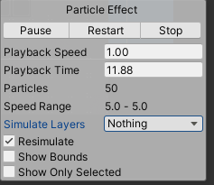


<a name="coll"></a>

### 4g Collectibles

There are two parts to a collectible: 

1. The collection of the item
2. The storage of the item in inventory

We will start with 1. the collection of an item

1. Find a sprite or animation to use as collectable. For simplicity, I will use a sprite like this:

   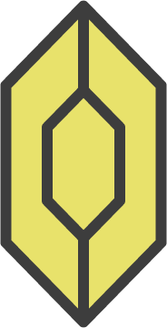
2. Drag gem into level
3. Add collider (I think box collider works best here) and check **Is Trigger**
4. Add a new tag and select it of the gem

   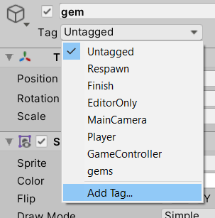
5. Within the player movement, we need to detect the collision overlaps and if an element of the tag overlaps the player, destroy object
This is done by putting the following code somewhere in the player movement class (not in an update or start method)

   ```c#
   private void OnTriggerEnter2D(Collider2D collision) {
       if (collision.gameObject.CompareTag("gems")) {
           Destroy(collision.gameObject);
       }
   }
   ```
6. (Optional) If you want to reuse the gem, drag in Prefab folder
Now we must consider the storage of the item in inventory. Note this can be as easy as a counter or a full fledged inventory

I will do a counter for simplicity:

\* Note while we are adding a counter, it is also a convenient time to add a sound of collecting the item. 

1. Resources for audio clip: [here](https://docs.unity3d.com/ScriptReference/AudioSource.Play.html) & [here](https://docs.unity3d.com/ScriptReference/AudioSource-clip.html) but I used [PlayOneShot](https://docs.unity3d.com/ScriptReference/AudioSource.PlayOneShot.html) 
2. Optionally, a collecting animation or particles could also be implemented
3. However, we will jump directly to a collectables counter
   1. Create a text layer by clicking UI -> Text - TextMeshPro
   2. Click on canvas -> Render Mode -> Screen Space - Camera
   3. Assign Render Camera to current Main camera
   4. Change layering order on canvas so it is in front
   5. Position it right. You may also chose to have a image accompanying the counter
   6. Create a collectablesManager script with the following:
      ```c#
      using System.Collections;
      using System.Collections.Generic;
      using UnityEngine;
      using TMPro;
      
      public class collectablesManager : MonoBehaviour
      {
          public static collectablesManager instance;
          public TextMeshProUGUI text;
          public int score = 0;
          // Start is called before the first frame update
          void Start()
          {
              if (instance==null) {
                  instance = this;
              }
          }
      
          // Update is called once per frame
          public void changeScore(int gemValue) {
              score += gemValue;
              text.text = "x" + score.ToString();
          }
      }
      ```
   7. Create empty to house the collectablesManager script and drag the script in
   8. Drag the text score into the Text field
   9. Now gems script and populate with the following: 
      ```c#
      using System.Collections;
      using System.Collections.Generic;
      using UnityEngine;
      
      public class gems : MonoBehaviour
      {
          // Start is called before the first frame update
          public int value = 1;
          private void OnTriggerEnter2D(Collider2D collision) {
              if (collision.gameObject.CompareTag("Player")) {
                  collectablesManager.instance.changeScore(value);
              }
          }
      }
      ```

      *Note by using this, you must have one collider with the player tag or the collectable might count twice. Optionally, you can make a new empty game object with the player tag than triggers the collection


Resource: https://www.youtube.com/watch?v=DZ-3g31jk90


<a name="anim"></a>

### 4h Animation

Animation is critical in creating any game that does not look static. In Unity, animation is handled by Animator and Animation windows. The **Animator** is a node based system while the **Animations** is a timeline based.

To make an animation, simply:

1. Drag more than 1 picture into the scene
2. Save your animations in the animations folder

You have made your first animation

To adjust your animation, go to the animator window and clip on the orange node.

You can change the speed here

To add different actions connected to the original animation:

    1. Go to the Animations window when the original animation is selected
    2. Click on animation dropdown -> Create New Clip...
    
     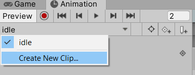
  3. Save the new animation
  4. It is recommended that you change the sample frame to the original animation's sample frame
  5. Drag all the new set of pictures to the timeline in the **Animations** window
  6. To change the pictures per second, drag the blue bar (all frames must be selected ie in blue)
  7. Now to move from any one animation (or state as it is called), go to the **Animator** window
  8. Right click on the **Any State** node -> Make Transition

     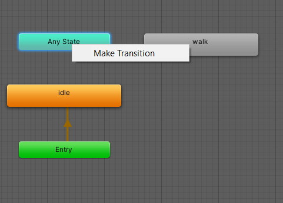
  9. We will link the idle animation to the other transitions, therefore, after selecting make transition, click on idle and this will connect any state to idle
  10. Also make transition to walk (or any other animation) from any state
  11. To link these states up, go to **Parameters** tab in the Animator window and click **+** -> int
  12. Name it
  13. Select transition Any State to idle
  14. in the inspector, expand Settings and
      1. Uncheck **Fixed Duration** if you want no transition duration
      2. **Change Transition** Duration to 0
      3. Uncheck can transition to self
      4. In Conditions, click **+**
      5. Set it equal to 0
      6. Do the same thing for **Any State** to any other animation to the same parameter except change step 5 to equal to some other number
  15. Now to connect the animations with the code so it changes with the actions performed by the player
  16. Go to the player movement script
  17. Add the following:
      ```c#
      private Animator animator; //attribute in class
      
      // add the following in Start
      void Start() {
          animator = GetComponent<Animator>();
      }
      
      // add the following in FixedUpdate
      void FixedUpdate() {
          // if moving, then idle, else set to moving animation
          if (moveInput != 0) {
              animator.SetInteger("AnimValue", 1);
          } else {
              animator.SetInteger("AnimValue", 0);
          }
      }
      ```
\* Note if you don't want the animation to loop, go to the animation in where you saved your animation and uncheck **Loop Time**

<a name="events"></a>

### 4i Events

Events are add much needed interactions into a game, but keep in mind that every event requires a lot of work. With this in mind, let's implement a button that triggers a platform. 

  1. Have a button and platform object ready. If not, feel free to use the ones below

     
  2. If you want, drag the two buttons as an animation so you can change the sprites when touched, but I will not go through the animations
  3. Add a button tag onto the button
  4. Create a button script and paste the following into the script
     ```c#
     using System.Collections;
     using System.Collections.Generic;
     using UnityEngine;
     
     public class button : MonoBehaviour
     {
         // renderer and timer
         public GameObject somePlatform;
     
         // change button state
         private Animator animator;
     
         // audio    
         public AudioSource audioSource;
         public AudioClip clip;
         public float volume = 0.2f;
     
         // timer for how long the platform stays
         private bool timerOn = false;
         public float timeLeft = 8.0f;
     
         private void Start() {
             animator = GetComponent<Animator>();
         }
     
         private void FixedUpdate() {
             // when pressed, wait for timer to go down, then revert
             if (timerOn) {
                 timeLeft -= Time.deltaTime;
                 if (timeLeft < 0) {
                     animator.SetInteger("button", 0);
                     somePlatform.SetActive(false);
                     timerOn = false;
                     timeLeft = 8.0f;
                 }
             }
         }
     
         // Start is called before the first frame update
         private void OnTriggerEnter2D(Collider2D collision) {
             // when collision with obj with player tag, set button to pressed down,
             // play tone, set platform active and activate timer to turn the things back to normal
             if (collision.gameObject.CompareTag("Player")) {
                 animator.SetInteger("button", 1);
                 audioSource.PlayOneShot(clip, volume);
                 somePlatform.SetActive(true);
                 timerOn = true;
                 timeLeft = 8.0f;
             }
         }
     }
     ```
  5. Click on script, drag audio stuff or remove all audio parts from script and set the object to **Some Platform**, also set the timer for when it reverts back to normal (auto is 8 seconds)

As you can see, using what we already know, we can get a lot of events to work! I know this may be challenging and you may run into bugs (hell, even I ran in many bugs), but persistent and challenge yourself and good luck!


<a name="pix"></a>

### 4j Pixelated

Perhaps you want your game to have a pixelized feel, thankfully, it is not too much work to do that with Unity. 

**General rules and tips**

Some extensions (especially with cameras) have options to enable **pixel perfect**. Whenever presented with that option, select it.

Otherwise when importing your pixel artwork or spritesheet; 

\* If you need pixel art to practice this section, take this:


Click on Filter Mode -> Point (no filter)

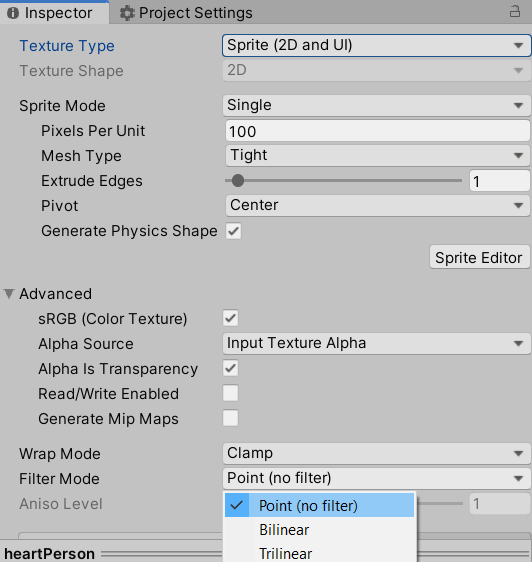

The point mode is like a nearest neighbour in Photoshop. This way, if you scale it, you will get the pixels to snap sharply. 

You may also change the pixels per unit to your desired size. 


<a name="music"></a>

### 4k Music & Sounds

Music is curial to a game's level of emersion. While I will not go into music theory and music in general, I will help you get familiar with how Unity handles sounds. This is something Unity does really well, so not much can be said in the chapter. 

If you need music to practice with, use main.wav in the **test_music** directory. Also note that this music is made by me and I give you permission to use it under creative commons license 

<a rel="license" href="http://creativecommons.org/licenses/by/4.0/"></a>

This work is licensed under a <a rel="license" href="http://creativecommons.org/licenses/by/4.0/">Creative Commons Attribution 4.0 International License</a>.

First, when dealing with sound, not much should be changed and when playing a sound, in the script that triggers the sound, just put the following in

  ```c#
  // audio    
  public AudioSource audioSource;
  public AudioClip clip;
  public float volume = 0.2f; // volume
  
  // to play sound
  audioSource.PlayOneShot(clip, volume);
  ```

The 3 options are

  1. AudioSource - where the sound is omitted from
  2. AudioClip - the audio file
  3. volume - the volume of the clip

For music, it is recommended that a **Audio Source** object is created and a script added to control the music and when to stop it

Otherwise, if starting and stopping the music is not a concern, just drag the music clip into the Audio Clip box and you are done

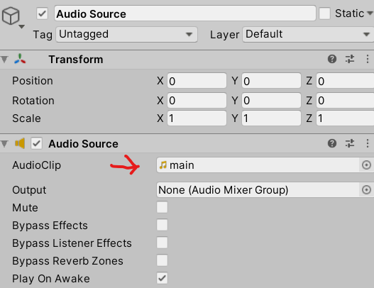

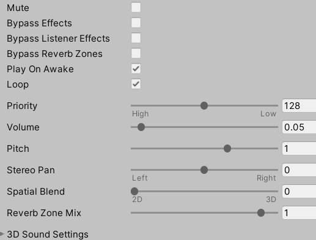

Below are some more options. Some important ones are the 

  1. Play on Awake - plays when scene is loaded 
  2. loop - loops track
  3. Volume - volume of track
  4. Pitch - shifts pitch (not recommended)


<a name="par"></a>

### 4l Parallax

Parallax is a popular way of displaying movement, especially if the game is a bit static.

What parallax does is like a old film reel, but instead of new frames, it is a repeat of the old frame(s).

  1. Within the main camera, drag in your parallax object (I will be using clouds) 
  2. Clone/ copy and paste another version of the parallax object and set it just right and left of the original object if you want it to go right to left. Note the theses should be a child of the original object
  3. Create new parallax script and put this in it:
     ```c#
     using System.Collections;
     using System.Collections.Generic;
     using UnityEngine;
     
     public class parallax : MonoBehaviour
     {
         private float length;
         private float startpos;
     
         public GameObject cam;
         public float parallex;
     
         // Start is called before the first frame update
         void Start()
         {
             // if you want to do it by the y, just change x to y
             startpos = transform.position.x;
     
             length = GetComponent<SpriteRenderer>().bounds.size.x;
         }
     
         // Update is called once per frame
         void Update()
         {
             float dis = cam.transform.position.x * parallex;
             float tmp = cam.transform.position.x * (1-parallex);
     
             transform.position = new Vector3(startpos + dis, transform.position.y, transform.position.z);
     
             if (tmp > startpos+length) {
                 startpos += length;
             } else if (tmp < startpos - length) {
                 startpos -= length;
             }
         }
     }
     ```
  4. Drag the script on the original parallax object
  5. Drag the main camera in the camera slot and play with the parallax number (between 1 to 0) to see how much parallax you want

Resource: https://www.youtube.com/watch?v=zit45k6CUMk


<a name="odds"></a>

### 4m Odds and Ends

For changing controls, go to Project Settings -> Input Manager and you can change your input from there

<a name="linked_scenes"></a>

#### Linking Scenes

Linking scenes is quite easy and just requires knowledge of the following:

  1. When moving to another scene (this will usually involve a detection collider), simply put
  ```c#
  using UnityEngine.SceneManagement;
  
  // and this to load a new or the same scene
  
  SceneManager.LoadScene('#scene name here');
  
  ```

  

<a name="death_zone"></a>

#### Death Zones

For this exercise, I will create a death zone if the player is out of bounds, however, this could easily be modified such that they are spikes. 

  1. Create an empty object to house the colliders for out of bounds
  2. Make the colliders are a series of sprites or a tile map. As long as a collider can be set to it such that Unity can detect when the Player's colliders collide with the out of bounds colliders, it is fine
  3. Create a new tag. I will call it **death**
  4. Create script **death** and paste in the following
     ```c#
     using System.Collections;
     using System.Collections.Generic;
     using UnityEngine;
     using UnityEngine.SceneManagement;
     
     public class death : MonoBehaviour
     {
         // collides with object tagged death
         private void OnTriggerEnter2D(Collider2D collision) {
             if (collision.gameObject.tag == "death") {
                 Die();
             }
         }
     
         // kills player and resets
         void Die() {
             Destroy(transform.parent.gameObject);
             SceneManager.LoadScene(SceneManager.GetActiveScene().name);
         }
     }
     ```
     \* Optionally, you can just add this to the movement player script
  5. Drag to player collider


<a name="enemies"></a>

#### Enemies

Enemies are an important yet complicated thing. They can be static, or mobile. Have easy or tough AI, or creates projectiles. For this example I will do medium-easy example of a creature in a box moving back and forth

  1. Drag Sprite or Animation in the scene
  2. New creatureMove script and paste in the following
     ```c#
     using System.Collections;
     using System.Collections.Generic;
     using UnityEngine;
     
     public class creatureMove : MonoBehaviour
     {
         // speed of creature
         public float speed = 5f;
         public bool smartTurn = true;
     
         // wall detection
         public Transform start, end;
     
         public bool collision;
     
         private Rigidbody2D body;
     
         // Start is called before the first frame update
         void Start()
         {
             body = GetComponent <Rigidbody2D>();
         }
     
         // Update is called once per frame
         void Update()
         {
             collision = Physics2D.Linecast(start.position, end.position, 1 << LayerMask.NameToLayer("Ground"));
     
             if (collision == smartTurn) {
                 transform.localScale = new Vector3(-transform.localScale.x, transform.localScale.y, 1);
             }
     
             body.velocity = new Vector2(transform.localScale.x, 0) * speed;
     
         }
     }
     ```
  3. Drag script to creature
  4. Create an empty object as a child of the creature
  5. To see the empty object that will act as a wall detector, press the cube icon and click on a large tag

     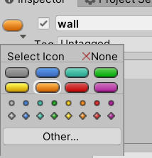
  6. Place empty object in front of the creature such that if that empty interacts a wall, the creature will turn
  7. Drag the creature itself into the creature box and the empty in the wall box
  8. Change speed to desired amount and check **Smart Turn** to make the creature turn instead of falling off an ledge
  9. If you want the creature to not walk off the edge, also cone the empty object and put it bellow the feet of the player so it is always touching the ground. Once it is not touching the ground, it should turn around


<a name="pausing"></a>

#### Pausing

Pausing with Unity can be made simple with one command. 

  1. Create script pause and drag it on your player (optionally, you can just do this in the movement folder, but this will be more organized)
  2. Create a pause UI element (I will be doing a simple Pause text)
  3. Paste in the following:

     ```c#
     using System.Collections;
     using System.Collections.Generic;
     using UnityEngine;
     
     public class pause : MonoBehaviour
     {
         public static bool paused = false;
     
         public GameObject pauseMenu;
     
         // Update is called once per frame
         void Update()
         {
             if (Input.GetKeyDown(KeyCode.P)) {
                 Pause();
             }
         }
     
         void Pause() {
             if (!paused) {
                 pauseMenu.SetActive(true);
                 Time.timeScale = 0f;
             } else {
                 pauseMenu.SetActive(false);
                 Time.timeScale = 1f;
             }
             paused = !paused;
         }
     }
     ```
  4. Place the UI element in the Pause menu box

Resource: https://www.youtube.com/watch?v=JivuXdrIHK0


<a name="quit"></a>

#### Quit

To quit game simply add the following onto the player:

  ```c#
  if (Input.GetKey("escape")) // change escape to any other character if you like 
  {
      Application.Quit();
  }
  ```

in the update method

\* Note, of course more logic could be added to make this more complicated


<a name="end2d"></a>

### 4n End Note

I hope you had a good taste of Unity 2D. Of course, this was just a very brief introduction and there are many more aspects of Unity not covered; ie UI buttons. You can go to my Unity 3D course below if you want to learn more, or start creating your 2D game. There are many more resources online for you to check out if you need help, or want inspiration. These resource can be found in [section 11](#Help) and thank you for joining me with this course. If you have any feedback, feel free to go to the [GitHub](https://github.com/Zeyu-Li/Unity-Tutorial-2D/discussions) and open a discussion. Again, thanks for viewing and good luck to your future Unity endeavors. 


<a name="finished"></a>

#### End Product


If you want to play it yourself (On windows, sorry Unix users 😜 need to build from source yourself):

1. Go to the the releases on the GitHub or https://github.com/Zeyu-Li/Unity-Tutorial-2D/releases/tag/1.0 
2. Download the template_build.zip
3. Unzip
4. Run the executable!

[🔝 Back to Top](#top)


<a name="3D"></a>

## 5. 3D

<a name="5a"></a>

### 	5a General

Good for you for deciding to go 3D. Before we go any further, it is not recommended that you start off with a 3D project if you are just starting out doing game design. Furthermore, it is recommended that you start with the previous 2D tutorial because some of the concepts and components will be similar or exact. 

To start a 3D project, press **New** and select 3D on the pop-up screen and use the desired directory (or follow my cloning [guide](#guide) so to not start from starch). This may take some time, but after Unity finishes installing itself, we can get started. Now let's make a 3D game!

When you start off, you will be brought up to a scene consisting of a directional light (which is like a ray/sun light) and a Camera

\* Note this tutorial (3D) follows this repo: https://github.com/Zeyu-Li/Unity-Tutorial-3D


<a name="5b"></a>

### 	5b 3D Models & Bodies

#### Resources

Before we get to 3D bodies in Unity, it is necessary to get 3D models. Unity is not build to be a 3D modeling software, so 3D objects should be created in 3D programs or imported from 3D libraries. Therefore, I will recommend some free software and libraries

<a name="software"></a>

#### Software

**Free**

* [Blender](https://www.blender.org/) - a very powerful open source 3D modeling, texturing, animations, and general 3D software. All my models in the exercises where made in Blender. A good place to start is with [Andrew's Donut](https://www.youtube.com/watch?v=TPrnSACiTJ4&list=PLxLGgWrla12dEW5mjO09kR2_TzPqDTXdw). New 2.8 version is very similar to all other 3D software. I **very strongly** advice you use Blender because it is free and is often much better than paid software
* [TreeIt](https://www.evolved-software.com/treeit/treeit) - a tree generator with presets that range from cacti to palm trees

**Paid**

* [Cinema 4D](https://www.maxon.net/en-us/products/cinema-4d/overview/) - 59.99USD/month (overpriced and not as good as Blender)

* [Autodesk Maya](https://www.autodesk.com/products/maya/overview) - 1 620 USD/year (supposedly the industry standard) 
  \* Note I don't know if they have a 3 year free for students like other Autodesk CAD software

* [Houdini](https://www.sidefx.com/products/houdini/) - 199 USD / year

* [Substance Designer](https://www.substance3d.com/products/substance-designer) - $19.90/month (for **revenue** under \$100k) a node based texture designer

  \* Note this is a really powerful piece of software, but from my experience, it is not easy to learn and textures can be found online or created with other programs like Adobe Illustrator and converted into normal maps in Blender.

\* Note don't use CAD software like Fusion 360, Revit, Solidworks etc, because those are for CAD (computer assisted design) and are aimed towards engineers. Also, Blender has Architectural Plugin with many of the functionality of Autodesk Revit. 

<a name="libraries"></a>

#### Libraries

* [Unity Asset Store](https://assetstore.unity.com/3d) - free and paid assets
* [Free 3D](https://free3d.com/3d-models/unity) - be careful, some items are not for commercial applications

**Textures**

* [3D Textures](https://3dtextures.me/)
* [TTextureHaven](https://texturehaven.com/)
* [CC0 Textures](https://cc0textures.com/)

<a name="m_unity"></a>

#### Unity

If you have experience with 3D software like Cinema 4D, Blender, or the Autodesk suit, Unity 3D will be very familiar to you. If you have not worked in a 3D environment, there is some adjusting. Note I will **not** go through the tools (ie rotate, scale, transform) for manipulating 3D bodies because they are the universal shortcuts and effects (ie. `w` for move, `e` for rotate, and `r` for scale). 

First off note that you do not need to make all 3D asset body. There are many asset stores with free and paid models. Usually I will use tons of free assets from the asset package (or go to [asset store](https://assetstore.unity.com/3d)) and if I need something custom, I model it with Blender. I recommend learning a 3D software before going into Unity 3D because it can be translated almost directly to Unity with light sources, objects, texture maps, etc. (my recommendation is to follow [Blender Guru](https://www.youtube.com/user/AndrewPPrice) on YouTube). 

To import 3D models/bodies, you will have to import it as a fbx file (make sure you export only the things you have selected (the model) and not everything including the camera, lights, etc. or you can choose to not import the camera or lights in Unity) 

From there I have a model that can be dragged into the scene. Now you have the model with the materials and other properties included.

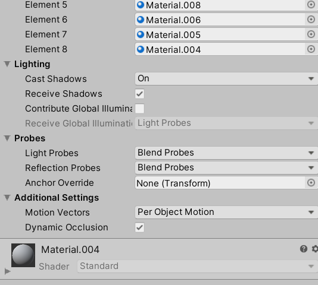

Of course, you can move it, rotate it, or scale it, but I will assume you know what to do that. However, if you want Unity to automatically general colliders for the model (generally good enough), 

1. Click on the model and under **Meshes** select **Generate Colliders**

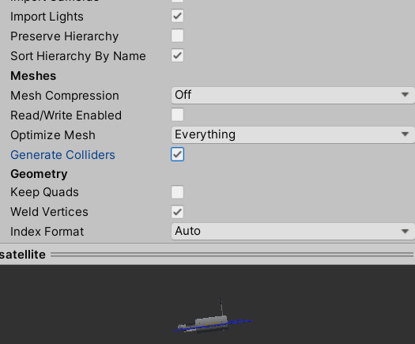
\* Note for some things like platforms, **Generate Colliders** can be bad as the optimized mesh collides with the player, therefore switch to box colliders

2. Click **apply**
3. Now Unity is generating colliders and this may take a while

If you want a object to be solid and non-movable (this will use bake lighting, which I will go in more detail later), check **Static**. Remember, this will generate a bake map, which is CPU intensive and may take a lot of time depending on the size of the model. Unfortunately, if the object is really big, checking Static may actually slow things down, so keep that in mind

**Clean Snapping**

In many 3D programs, you will get options to snap to another object or vertex. This can be done in Unity. To achieve this,

1. Select **Shaded Wireframe** as the view

   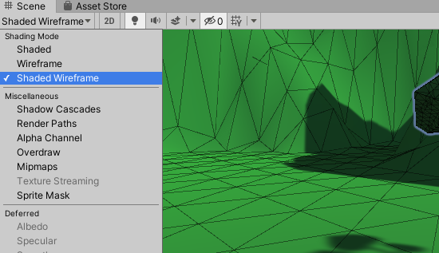
2. Click on the **Move Tool** (the one with the arrows in 4 directions), hold down the **v key** and it will snap to a vertex 
3. With the v-key still help, drag and it will snap to another vertex 
\* Note if you want to organize the 'layers', use **Quads** as they are 3D equivalents of empties

Resource: https://youtu.be/NjflKgMepQs


<a name="5c"></a>

### 	5c Movement

**Legacy Way:**

~~For movement, generally, Unity's Standard Package can be used so no bones, animations, or controls need to be wired. I recommend importing Unity's character package. This is done by,~~

1. ~~installing the [Unity Standard Assets Package](https://assetstore.unity.com/packages/essentials/asset-packs/standard-assets-for-unity-2017-3-32351) in the **Asset Store**~~
2. ~~In a new player folder, go to Assets -> Import Package -> Characters and click **Import** (this may or may not work and thus, you may need to import all of the standard package and purge unused)~~
3. ~~In the imported Standard Assets, go to Characters -> FirstPersonCharacter->Prefabs->FPSController and drag it into the scene~~

**New way:**

Now that no Standard Packages exist, the easiest way to make a player is to create it from scratch

1. New empty object named player
2. add a **character controller** as a component to the empty
   1. You can change the slope limit (limit angle at which you traverse a slope)
   2. Skin width
   3. Center at which the character is based on 
   4. Radius and Height of the capsule containing the player
3. Add a camera to the empty, otherwise, move the empty exactly to the existing camera and move it such that it does not overlap meshes
4. At this point, you can add the mesh that is your player and have it hold up to some animations or preloaded with animations, but for this tutorial, I will use a yellow capsule
5. Next we want to control the camera with the mouse so create a cameraControl script in the scripts folder
6. Paste the following in
   ```c#
   using System.Collections;
   using System.Collections.Generic;
   using UnityEngine;
   
   public class cameraControl : MonoBehaviour
   {
       // sensitivety of mouse
       public float mouseSpeed = 100f;
   
       // place camera here
       public Transform player;
   
       float xRotation = 0f;
   
       // Start is called before the first frame update
       void Start() {
           Cursor.lockState = CursorLockMode.Locked;
       }
   
       // Update is called once per frame
       void Update()
       {
           float mouseX = Input.GetAxis("Mouse X") * mouseSpeed * Time.deltaTime;
           float mouseY = Input.GetAxis("Mouse Y") * mouseSpeed * Time.deltaTime;
   
           // for every frame, move camera up or down
           xRotation -= mouseY;
           // clamp the up down rotation
           xRotation = Mathf.Clamp(xRotation, -85f, 85f);
   
           transform.localRotation = Quaternion.Euler(xRotation, 0f, 0f);
           player.Rotate(Vector3.up * mouseX);
       }
   }
   ```
7. Optionally, you can smooth out the camera using the Lerp method
8. Drag the player empty object into the Transform
9. Next is movement
10. Add a new player movement script to the empty player object
11. Paste the following
    ```c#
    using System.Collections;
    using System.Collections.Generic;
    using UnityEngine;
    
    public class movement : MonoBehaviour
    {
        public CharacterController controller;
    
        public float movementSpeed = 14f;
    
        // gravity
        public float gravity = -10f;
        Vector3 velocity;
    
        // ground check
        public Transform groundCheck;
        public float checkRadius = 0.1f;
        public LayerMask ground;
    
        public bool isGrounded = false;
    
        // jump
        public float jump = 1f;
    
        // slope
        public bool isSliding = false;
        public float slopeLimit = 35f;
        private Vector3 slopeParallel;
    
        // Update is called once per frame
        void Update()
        {
            // is grounded calculations
            isGrounded = Physics.CheckSphere(groundCheck.position, checkRadius, ground);
    
            if (isGrounded) {
                velocity.y = -2f;
            }
    
            float x = Input.GetAxis("Horizontal");
            float z = Input.GetAxis("Vertical");
    
            Vector3 move = transform.right * x + transform.forward * z;
    
            controller.Move(move*movementSpeed*Time.deltaTime);
    
            // slopes, modified from https://answers.unity.com/questions/1502223/sliding-down-a-slope-with-a-character-controller.html
            if (isGrounded) {
                RaycastHit hit;
                Physics.Raycast(transform.position, Vector3.down, out hit);
                // Saving the normal
                Vector3 n = hit.normal;
    
                // Crossing my normal with the player's up vector (if your player rotates I guess you can just use Vector3.up to create a vector parallel to the ground
                Vector3 groundParallel = Vector3.Cross(transform.up, n);
    
                // Crossing the vector we made before with the initial normal gives us a vector that is parallel to the slope and always pointing down
                slopeParallel = Vector3.Cross(groundParallel, n);
                Debug.DrawRay(hit.point, slopeParallel * 10, Color.green);
    
                // Just the current angle we're standing on
                float currentSlope = Mathf.Round(Vector3.Angle(hit.normal, transform.up));
    
                // If the slope is on a slope too steep and the player is Grounded the player is pushed down the slope.
                if (currentSlope >= slopeLimit) {
                    isSliding = true;
                }
                // If the player is standing on a slope that isn't too steep, is grounded, as is not sliding anymore we start a function to count time
                else if (currentSlope < slopeLimit && isSliding) {
                    isSliding = false;
                }
            }
    
            if (isSliding) {
                controller.Move(slopeParallel.normalized / 2 * Time.deltaTime);
            }
    
            // jump
            if (Input.GetButtonDown("Jump") && isGrounded) {
                velocity.y = Mathf.Sqrt(jump * -2f * gravity);
                if (isSliding) {
                    // cut jump in halve
                    velocity.y /= 2;
                }
            }
    
            velocity.y += gravity*Time.deltaTime;
    
            controller.Move(velocity * Time.deltaTime);
        }
    }
    ```
    This accounts for gravity and movement
    \* Note you can change the speed of movement, gravity constant, jump check radius, under the script. Also, sliding down slopes is a given
12. For the gravity to work properly, a ground check must be preformed to reset the velocity. To do this, create empty object in player and place at the feet of the player
13. Add new layer of ground to preform jumps and gravity checks on and apply it to the models

Resource: [Brackeys](https://www.youtube.com/watch?v=_QajrabyTJc)


<a name="5d"></a>

### 	5d Camera

There are a few options for cameras. For a fixed camera following the player:

1. Nest the camera into the Player
2. Move to the right position and angle


There are special camera options (such as a more flexible or switching to several fixed cameras) that use Cinemachine. Tutorials for Cinemachine can be found below:

[Brackeys](https://www.youtube.com/watch?v=Gx9gZ9cfrys)

[FilmStorm](https://www.youtube.com/watch?v=J1GgvDfmIo0)


<a name="light"></a>

### 	5e Lighting

Just like other 3D applications, Unity has an array of lighting options

The most important of these are the following:

1. Point light - light is emitted from a point
2. Directional light - a moon or sun light. Position does not matter, but the rotation determines the angle of attack
3. Spot light - like that of a lamp
4. Light Area - light emitted from an area

From there, we can change some properties of the lights:

* range - range of light source
* color - color of light
* shadow type
  * soft shadows - blurred shadow
  * hard shadows - very rough edged shadows

Some other light options include an ambient light that lunates everything. This can be changed this in the Window -> Rendering -> Lighting Settings. From there, there are many options can you can play with. Also in the options is to add atmospheric fog.

Another important things about lighting is bake lighting. Baking is a way to save space by "baking" or pre-mapping the lighting in the texture map so lighting does not need to be calculated again in real time. This may be something you would want to look into if you have problems with framerate, or just want to speed/smooth out the game. 


<a name="5f"></a>

### 	5f Prefab

A prefab is simply a clone that can be dragged to the scene

This means that things in other scenes can be reused

To make a prefab, just drag the desired prefab object from scene to the prefabs folder


<a name="5g"></a>

### 	5g Particle Systems

3D particle systems are very similar to 2D particle systems, therefore so particle options, go to the 2D [particle section](https://github.com/Zeyu-Li/unity-user-guide#4f-particle-system) for help with the options

For this tutorial, I will just be adding a smoke particle effect from a pipe

1. Import the pipe. I have one provided in the models folder if you want to follow along. (Again, this model was made by myself and you can use it in your projects) 
2. In the new model, add a new **particle system** be right clicking -> Effects -> Particle System
3. Move, rotate and scale it to the right size (note the scale should be equal in all directions (x,y,z) for it to remain uniform)
4. Changing the shape will determine the emission's direction
5. Changing other attributes with the link above to the desired particle
6. To change the texture of the particles, just drag and drop the image onto the particles


<a name="3anim"></a>

### 	5h Animation

Unity animations are very similar to other 3D animating software. This means there is a timeline with keyframes. For this tutorial, I will be doing a spinning and blobbing key. 

1. Place the object in the scene
2. Go to the animation window and click **Add Animation**
3. Save to the animation folder and set the time to whatever
4. From there, you can click **Add Property **add something you would like to change over time
5. For my example, I chose to key frame the rotation and position
6. Set the start value and click the **Add Keyframe** (which looks like a diamond).
7. Go to the end position and change the keyframe value (once changed the text area should be red) and click **Add Keyframe**
8. Note the curves are set to non-linear (ie ease in and ease out). Therefore, to make them linear, I found the easiest way to do that would be to go the the **Curves **tab, click on the keyframe and a handle will appear. Drag the handle to the first keyframe or vice versa.

\* If you want to move this in global space, encapsulate it in a empty object and move the empty

Another way to the the animation is to do it in the 3D program of choice (for me Blender) and export the animation within the fbx file format

1. Have the export fbx with animation made
2. Click on the fbx in Unity and change it to **Animation**

   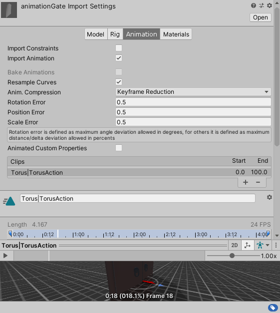
3. If you have several animations, you have to separate the different animations apart by clicking the add icon (below) and adjusting the start and end frames

   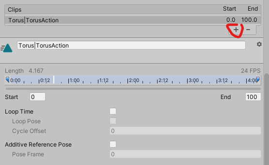
4. Create an animations controller and rename it. Also double click it
5. It will open up the Animator window so right click and click Create State -> Empty
6. Open the new empty state and rename it. Afterwards, change the motion to the imported motion (ie, it would be Torus|TorusAcion for my animation (seen above))
7. Add an **Animator **to the animated object in scene and add the controller. If you enable the animator the animation plays. With this in mind, I will use an event to enable the animation [later](#3events)

   

<a name="3coll"></a>

### 	5i Collectables

1. The collectable should have the desired tag before starting

2. Within the player controller (movement.cs) check for collision with the tag. If overlap, destroy the object

   ```c#
   private void OnTriggerEnter(Collider collision) {
       if (collision.gameObject.CompareTag("key")) {
           Destroy(collision.gameObject);
       }
   }
   ```

3. Now once the player collides with the key, the key is destroyed

Next thing we might want to do is add the key to our inventory. 

1. Create a UI -> Canvas count object to be displayed once the object is collected
   For my project, it is simply a sprite of a key appearing as I collect it

2. The player should have the player tag

3. Create a new script for the key once it is collected by the player

4. I named my script key and had this in my script:

   ```c#
   using System.Collections;
   using System.Collections.Generic;
   using UnityEngine;
   
   public class key : MonoBehaviour
   {
    public GameObject menu;
       private bool isShowing = false;
   
   
       // Start is called before the first frame update
       private void OnTriggerEnter(Collider collision) {
           if (collision.gameObject.CompareTag("Player")) {
               isShowing = true;
               menu.SetActive(isShowing);
           }
       }
   }
   
   ```

Now if the key is collected, the key will show up on screen


<a name="3events"></a>

### 	5j Events

For this tutorial, I will make an event that activates once the key is collected. After which, a door opens. 

\* Note this is working from the last collectables and animation section

1. Within the key script, replace with the following:
   ```c#
   using System.Collections;
   using System.Collections.Generic;
   using UnityEngine;
   
   public class key : MonoBehaviour
   {
       public GameObject menu;
       private bool isShowing = false;
   
       // gate animation
       public GameObject gate;
       Animator gateAnim;
       public GameObject goal;
   
       private void Start() {

           gateAnim = gate.GetComponent<Animator>();
   
       }
   
       // Start is called before the first frame update
       private void OnTriggerEnter(Collider collision) {
           if (collision.gameObject.CompareTag("Player")) {
               isShowing = true;
               menu.SetActive(isShowing);
               gateAnim.enabled = isShowing;
               goal.enabled = isShowing;
           }
       }
   }
   ```
2. Drag the gate containing the animator into the gate box and a goal with a collider to send you to the end screen to the goal box
3. Now when the player collects the key, the gate will open and a goal with appear to the player to get to

Now the final set is to send the player into the end screen after colliding with the goal box

1. Set up the goal box
2. Set up a new scene with the endscreen (this will simply be a black screen saying to be continued)
3. Make a new script in the goal object
4. In the script simply type out the following
   ```c#
   using System.Collections;
   using System.Collections.Generic;
   using UnityEngine;
   using UnityEngine.SceneManagement;
   
   public class endScene : MonoBehaviour {
       static public bool end = true;
       private void OnTriggerEnter(Collider collision) {
           if (collision.gameObject.CompareTag("Player")) {
               Done();
           }
       }
   
       // Update is called once per frame
       void Done() {
           SceneManager.LoadScene("title");
       }
   }
   ```


<a name="3music"></a>

### 5k Music & Sounds

Music and sounds are important in the gameplay as it immerses the player into the game. This section will be split into two parts, music and sounds. 

**Music**

Adding a track to the game is as easy as counting to 3. 

1. Have a music track (you can use mine called happy if you so choice)
2. Simply drag the music into the player object
3. In the settings you can change if it plays on startup and if it loops

\* Note when you are playing the game, don't forget to hit unmute

**Sounds**

Ambient sounds can be a great way to add that something extra to the game. This can be rustling leaves or  footsteps. For this tutorial, I will do footstep sounds when the player walks.

1. Have a sound to play (an excellent resource is https://freesound.org/)

2. In the movement script add the following:

   ```c#
   public class movement : MonoBehaviour
   {
   
       // sound
       public AudioClip[] footsteps;
       public float volume = .5f;
       public AudioSource listener;
       private int index;
       private float counter = 0;
   
       private void Start() {
           listener = GetComponent<AudioSource>();
       }
   
       // Update is called once per frame
       void Update()
       {
           // is grounded calculations
           isGrounded = Physics.CheckSphere(groundCheck.position, checkRadius, ground);
   
           float x = Input.GetAxis("Horizontal");
           float z = Input.GetAxis("Vertical");
   
           if (isGrounded) {
               velocity.y = -2f;
               // plays walk sound
               if (counter <= 0 && (x != 0f || z != 0f)) {
                   index = Random.Range(0, footsteps.Length);
                   counter = footsteps[index].length;
                   listener.PlayOneShot(footsteps[index], volume);
               }
               counter -= Time.deltaTime;
           }
   
           Vector3 move = transform.right * x + transform.forward * z;
   	}
   }
   ```

3. Grab the footsteps and place it in the footsteps audioclips after putting the number of audio clips to randomly chose from

4. Add the audio listener and change volume


<a name="3odds"></a>

### 5l Odds and Ends

<a name="3_pausing"></a>

#### Pausing

Pausing with Unity can be made simple with one command. 

1. Create script pause and drag it on your player (optionally, you can just do this in the movement folder, but this will be more organized)
2. Create a pause UI element (I will be doing a simple Pause text)
3. Paste in the following:
   ```c#
   using System.Collections;
   using System.Collections.Generic;
   using UnityEngine;
   
   public class pause : MonoBehaviour
   {
       public static bool paused = false;
   
       public GameObject pauseMenu;
   
       // Update is called once per frame
       void Update()
       {
           if (Input.GetKeyDown(KeyCode.P)) {
               Pause();
           }
       }
   
       void Pause() {
           if (!paused) {
               pauseMenu.SetActive(true);
               Time.timeScale = 0f;
           } else {
               pauseMenu.SetActive(false);
               Time.timeScale = 1f;
           }
           paused = !paused;
       }
   }
   ```
4. Place the UI element in the Pause menu box

Resource: https://www.youtube.com/watch?v=JivuXdrIHK0


<a name="3_exit"></a>

#### Exit Game

To quit game simply add the following onto the player:

```c#
if (Input.GetKey("escape")) // change escape to any other character if you like 
{
    Application.Quit();
}
```

in the update method

\* Note, of course more logic could be added to make this more complicated


<a name="3demo"></a>

### 5m Demo

I hope you enjoyed this tutorial and the finished version is here.

Unfortunately, I cannot insert a demo here as it would be too long (if you want to download the game see instructions below), but I can share some screenshots here:

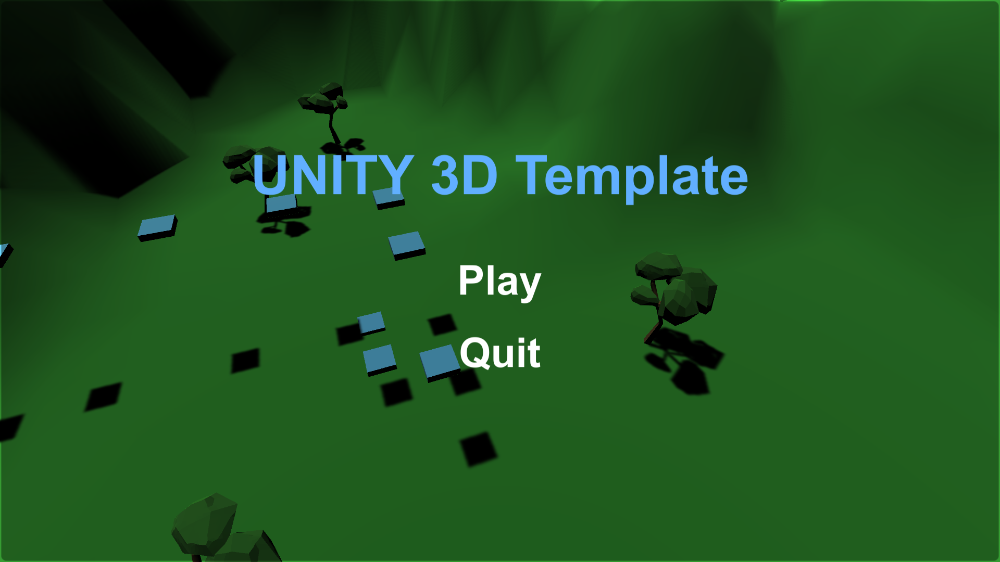

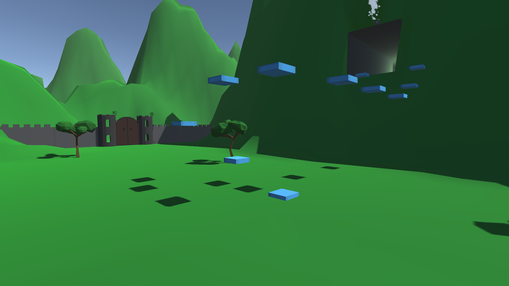

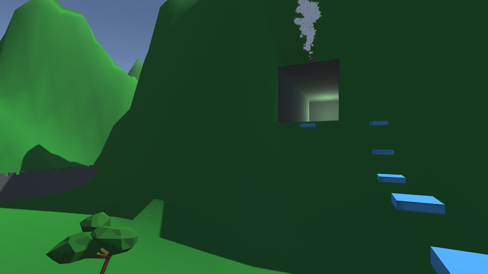

Feel free to [play the game](https://github.com/Zeyu-Li/Unity-Template-3D-2019_3/releases/tag/1.0) or use any of the resources for the game. I hope you've enjoyed this experience and I wish you luck in making your games!

If you want to play it yourself (On windows, sorry Unix users 😜 need to build from source yourself):

1. Go to the the releases on the GitHub or https://github.com/Zeyu-Li/Unity-Tutorial-3D/releases/tag/1.0 
2. Download the 3D_template_game.zip
3. Unzip
4. Run the executable!

[🔝 Back to Top](#top)


<a name="3_title"></a>

### 6. Title Screen

One of the last things to do is to create a title screen. I will be basing my title screen on the 3D game.

1. For my scene, it is the camera spinning through the 3D scene

2. Overlaid is a canvas with a black panel within it

3. Now you can populate with text, sprites, buttons and so forth, adjusting them to your liking

4. To add functionality to the button, attach a script to the collection of menu object

5. Populate with functions of the button in their own separate methods. For example, my script looks like the following:

   ```c#
   using System.Collections;
   using System.Collections.Generic;
   using UnityEngine;
   using UnityEngine.SceneManagement;
   
   public class menu : MonoBehaviour
   {
       // Start is called before the first frame update
       public void play() {
           SceneManager.LoadScene("main");
       }
   
       public void quit() {
           Application.Quit();
       }
   
   }
   ```

6. With the button selected, click on the **+** icon in the On Click part (below)

   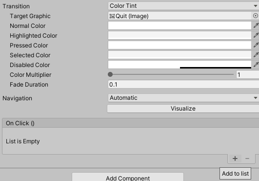

7. Drag the menu in the None (Object) box

8. In the drop down (no function), change into the function you want to activate (it will be in the name of the script)


<a name="script"></a>

### 7. Scripting

Unity is based on C# and is very much a c-styled programming language. That means it resembles programs that are written in C, C++, F#, or Java. 

The main thing to know though is Unity's implementation of C#

If you create a script, automatically, it will be drawn from a template that looks similar to the following:

```c#
using System.Collections;
using System.Collections.Generic;
using UnityEngine;

public class movement : MonoBehaviour
{
    // Start is called before the first frame update
    void Start()
    {
        
    }

    // Update is called once per frame
    void Update()
    {
        
    }
}
```

You will notice that at the top there are imports from Unity's other libraries using the **using** keyword. Afterwards, Unity defines the script as a class*. The class is defined as public so other scripts and Unity can assess and utilize this class. The name you gave the script will follow the **class** keyword. Afterwards, **MonoBehaviour** is defined as what movement inherits from. Think of this as your script **extending** from class MonoBehaviour. 

\* Note a class is a data structure that holds a collection of information on the class (ie. its attributes and methods). 

Below that and indented, we see void Start() and void Update(). As the comments suggest, void Start() occurs before the first frame update and void Update() is called once per frame. Note **void** means there will not be a return value (ie. no return statement).

Also, there are different methods of MonoBehaviour such as **FixedUpdate()** that may update more or less than once per frame. This will be important for any physics related functions

A list of other functions and methods that can be used can be found on the [Unity Documentation](https://docs.unity3d.com/ScriptReference/MonoBehaviour.html) site, however, the most important thing about learning and debugging Unity is to use

```c#
Debug.Log() // logs to Unity console
```

When using this, after running the game, it will output to Unity's debug console


<a name="build"></a>

### 8. Build

So you are finished your game. You need to disturbed the game. This is done through building the game. 

1. Go to **File**, **Build Settings...**

2. Select the scenes that you want to build

   

3. Select the desired **Platform**

4. You can customize the company name, product name, icon, and cursor

5. **Build** (**And Run** if you want to run it)

6. Select the folder and wait for it to build

\* Note if you did not add an exit game button, the only way to exit is to close the program externally or Alt-f4


<a name="guide"></a>

### 9. Cloning Guide

To download the finished projects:

1. Find the right Unity Repo to clone from my account (https://github.com/Zeyu-Li/Unity-Tutorial-2D or https://github.com/Zeyu-Li/Unity-Tutorial-3D) 

2. Download ZIP after clicking Clone or download

   

3. Unzip and move to desired directory

4. Go on Unity Hub and click **Add** and located to directory

5. The project should appear in Projects and it is done

6. Click on the project to open it

  \* Note if you want the project at different steps for 2D click on commits or https://github.com/Zeyu-Li/Unity-Tutorial-2D/commits/master and between Feb 26, 2020 `added logo` commit to April 12, 2020 `finished Unity template game` is when various steps where completed. To download the project file at these times, click on the bracket thing (see below) and repeat above from step 2

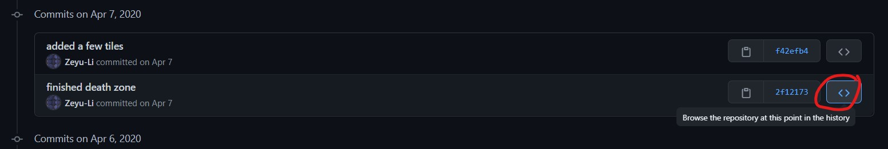

else for 3D, go to https://github.com/Zeyu-Li/Unity-Tutorial-3D/commits/master and between April 13, 2020 `added imaged` commit to May 6, 2020 `finished game` is when various steps where completed. 


<a name="team"></a>

### 10. Collaboration

<a name="unity"></a>

#### Unity's Collab

Collaborating with friends can be tough will Unity, especially with git/GitHub, but it you are careful, things could turn out fine.

If you need to collaborate, the best way is to use Unity's Collab feature


However, note that this only supports 4 people (which is usually enough because only people that will contribute to the codebase should need it)


<a name='git'></a>

#### GitHub

Otherwise if you are a masochistic and decide to GitHub, here are some general practices:

1. Everyone should work on there own branches and work on there own scenes working towards **Prefabs** (ie one person on movement, one on moving platforms, etc.)
2. Optionally, have one person on the master (final) level to peace it together
3. Use [this](https://github.com/github/gitignore/blob/master/Unity.gitignore) gitignore or clone from my projects on GitHub
4. Have the core gameplay done first (especially at a Game Jam)
5. Get to know Git/GitHub and how version control works
6. Remember you can go back to a previous working version
7. Have fun and don't fight with your team members

[🔝 Back to Top](#top)


<a name="Help"></a>

### 11. Resources

* The [Unity User Manual](https://docs.unity3d.com/Manual/index.html) provides some great documentation with code that can for the most part be copied and pasted
* Brackeys [YouTube channel](https://www.youtube.com/user/Brackeys)
* [Lynda.com](https://www.lynda.com/) - If you have a library card, there is a high probability that you have access to Lynda with their organization deal
* Google is your best friend
* Ask on Reddit or Stack Exchange, don't worry they won't bite

