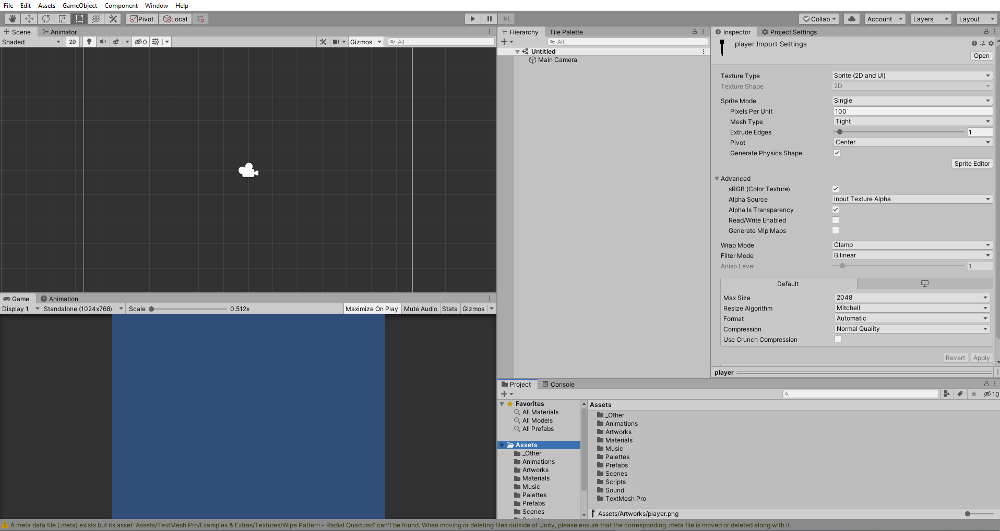
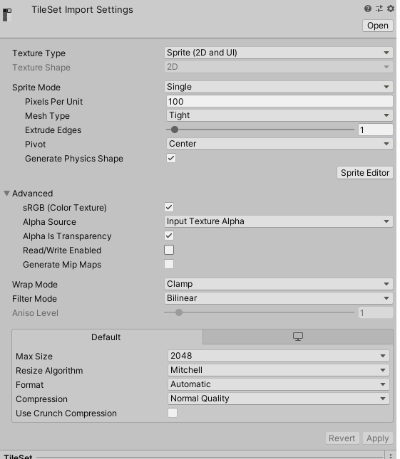
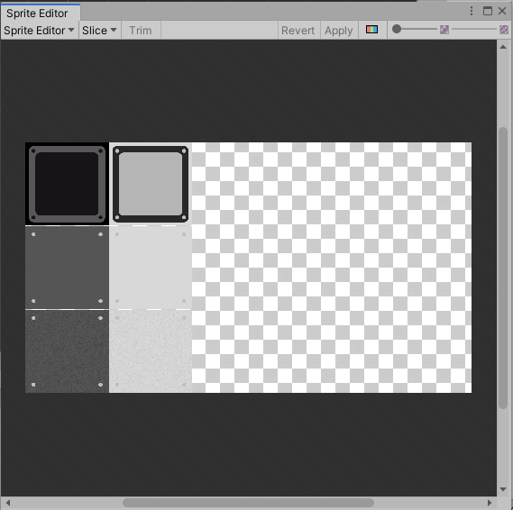
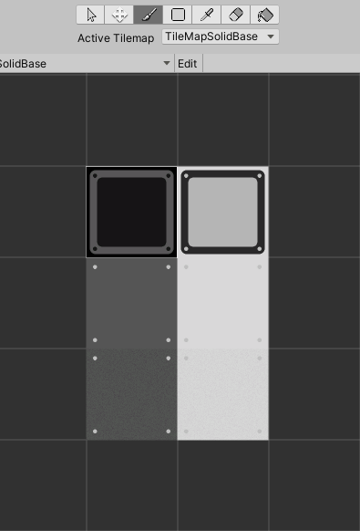
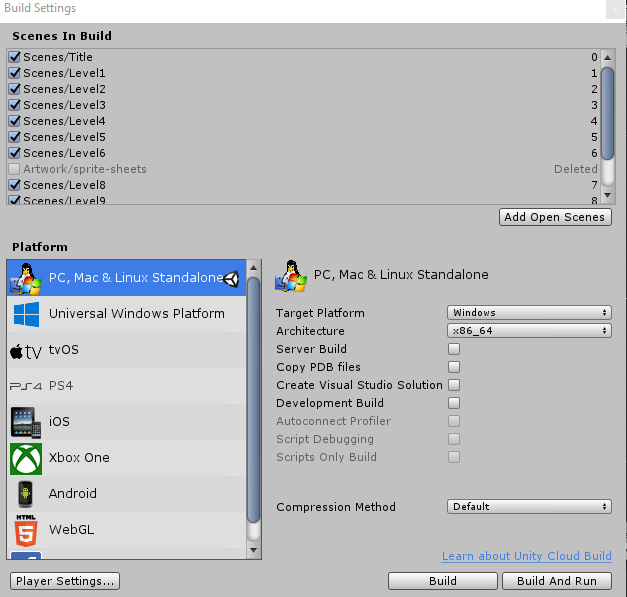
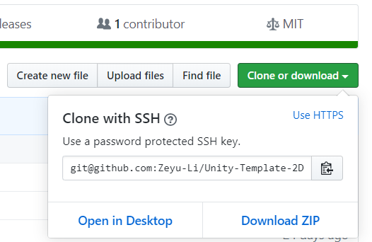
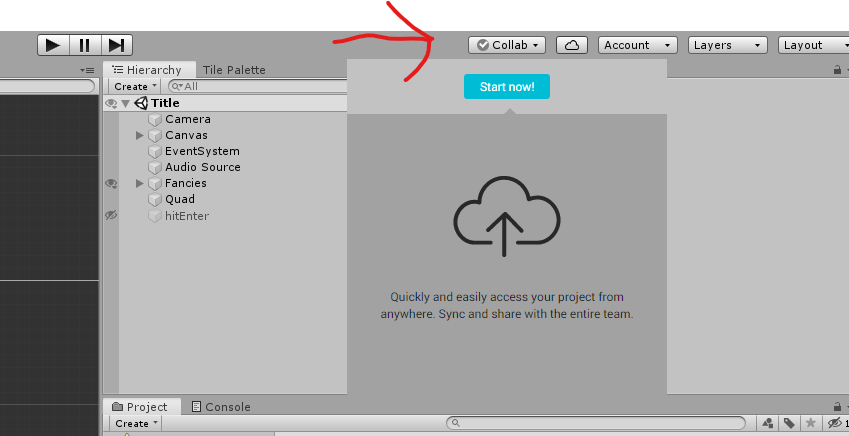

# Unity User Guide

## About

This is a [Unity](https://unity.com/) User guide

I will start at the beginning and work my way through the variations avenues you could have about your game. I will go through 2D and 3D games along with general tips and tricks for solo and team-based projects. Without future ado, let's begin! 

<a name="top"></a>

## Index

1. [Installation](#install)
2. [General](#main)
3. [Unity Editor Overview](#unity)
4. [2D](#2D)
   * [General](#2dg)
   * [Sprites](#spr)
   * [Movement](#move)
   * Pixelated
5. 3D
   1. [General](#5a)
   2.    
6. [Building](#build)
7. [Cloning Guide](#guide)
8. [Collaboration](#team)
   * [Unity's Collab](#unity) (recommended)
   * [GitHub](#git)
9. [Resources](#help)

<a name="install"></a>

### 1. Installation

Before installing, note that Unity is completely free forever, if you or your company makes less than $100 000 (USD). 

Follow the link [here](https://store.unity.com/download) and download the free installer (the plus version is definitely not necessary). Follow the instructions and download the installer. The installer is simple and easy however, if you run into trouble, go to this [video](https://www.youtube.com/watch?v=KMuMhA6Lk0I) for Windows. Also note that you will may need a Unity account or just use your Google/ Facebook account to sign in. 

If you want a new version of Unity, go to the Unity Hub and click the **Installs** tab on the left and **add** (top right) the desired version. Afterwards, the installation will take quite a while, even with a fast internet connection. 

When installing Unity, it might ask you to install **Visual Studio** along-side Unity. If you have Visual Studio, do not install again, it should automatically detect the current VS on the system. Otherwise, it is optional and I've heard that MonoDevelop (comes with Unity) is good enough for handling the task Unity puts forth. 

<a name="main"></a>

### 2. General

**Unity** is a 3D game engine built in **C#** but can be used for 2D. Before you freak out about programming, let me assure, you it is quite trivial. If you have programmed before especially in C++, it is a huge plus. If you have not, don't worry, it's just a bunch of copy and pasting. The most important thing is don't be frustrated and 

```c#
Debug.Log() // logs to Unity console
```

is your friend. Also organize your scenes by naming them or using empties as folders (+1 organization). Now, it is time to pick, 2D or 3D. (As a beginner, start with 2D)

<a name="unity"></a>

### 3. Unity Editor Overview

Unity is a panel based application. These panels can be rearranged however you like and saved as default. 



This is my default setup. The **Scene** panel is the most important viewport. This is where you modify the scene. The **Game** scene only turns on if you hit play. It is a preview of what the user will see if you build the current scene.

On the right hand side, we have the **Project** directory (folder) panel on the bottom. This is where all your assets are (ie art, music, scripts, etc.). The **Hierarchy** is like a layers panel in Photoshop. It is an arrangement of all elements in the scene. For every element of the scene can be hidden from the view by hitting eye button when hovering on the element. The lock button is the pointer icon. The **Inspector** contains all modifiable aspect of an element along with info. This is where you drag scripts in the element.

Other panels include a console, which will output when the game is run. The **Animator** and **Animation** go hand in hand and creates animation for sprites. 

<a name="2D"></a>

### 4. 2D

<a name="2dg"></a>

#### 	4a General

So you've decide to make a 2D game. Great! Who needs modelling and lighting (It's a lot of work anyways)? 

2D games are secretly 3D, what does that mean? Think of Unity 2D as a bunch of layers like in Photoshop, Gimp, After Effects, or Illustrator. The closest to the camera is picked up first and blocks the ones behind it. As a 2D world, lighting is global (unless you want enable an experimental local lighting feature). To start a new 2D game, click **New** and select 2D on the pop-up screen and use the desired directory (or follow my cloning [guide](#guide) so to not start from starch). This may take some time, but after Unity finishes installing itself, we can get started. Now let's make a player and make it move!

*Note, part of the tutorial (2D) follows this [repo](https://github.com/Zeyu-Li/Unity-Template-2D-2019_3): [Unity-Template-2D-2019_3](https://github.com/Zeyu-Li/Unity-Template-2D-2019_3)

<a name="spr"></a>

#### 	4b Sprites

Sprites are what make up the visuals of the game. These could be png or jpeg (recommended because of small size) file. You can make your own and drag them into an **Artworks folder**.

If you have multiple sprites on a picture file, you have what is called a sprite sheet. These could be useful because it saves space. Unity comes with a sprite editor that can cut the sprite sheet into multiple sprites. 

However, before we get to that, let us take a look at the Sprite setting



From the top header, we can see some info on the item

From the header we also see:

* Texture Type - Usually will only use sprite (2D image) or normal map (for 3D depth)
* Sprite mode - as single texture or sprite sheet
  * Adjust the pixels per unit (Pixels per unit should be 1-1) (In my case, it is 360 px per tile)
  * Pivot - where the center of object is
* Wrap Mode - how the image is displayed (ie repeated or clamped(/cut) at the board)  
* Filter Mode - Point (equivalent to pixel perfect or nearest neighbour in Photoshop) or Bilinear (natural scaling with edge softening)
* Format - Format of image (8bit, 16 bit, 32 bit colour with or without alpha)

*Note, if a setting was not mentioned, it is not that important at the beginner level.

**Multiple Sprites**

1. Select Multiple in **Sprite Mode**

2. Click **Spirit Editor** button

   

3. In sprite editor, click Slice -> Slice (This is an automatic slicer and is usually good enough, if not, manually move the transform bound boxes to fit or define split at distance apart (must change to **Grid by Size Count**, not **Automatic**) with the size of tile in **Pixel Size**.

4. Click apply

5. Close window or drag to some widget

6. You can inspect every tile by expanding the original image and a bunch of tiles with name pictureName_0 to # of tiles with be a child of it

Now, with a sprite, you can drag it into the scene

To create a tile map, follow the following:

1. GameObject -> 2D Object -> Tile Map
2. Open Tile Palette, by going to Window -> 2D -> Tile Palette
3. Create New Palette and save it
4. Drag all individual tiles into widget or drag parent spritesheet (and save)


Now with the tile palette, you can draw on the scene, reorganize everything and many other things



From the top, there are many icons, we will go through each of them

* Curser - selects tiles from scene
* Move - Moves tiles in palette (Only if you click **Edit**)
* Brush - paints on scene
* Square/Rect - Selects multiple tiles or one to paint from
* Eye dropper - Selects tile from scene
* Eraser - Erases
* Paint Bucket - Floods with active brush (Like Photoshop)

Resources: [Brackeys](https://www.youtube.com/watch?v=ryISV_nH8qw)

<a name="move"></a>

#### 	4c Movement

Movement is critical in all games, whether the movement is limited to left or right, or games that in 3D. On the internet there are may sources that claim the perfect jump, but only you can decide that based on the gameplay. 

To start off with, make a new folder of scripts

<a name="3D"></a>

### 5. 3D

#### 	5a General

3D, it's where we live. Good for you for deciding to go 3D. Before we go any further, it is not recommended that you start off with a 3D project if you just started game design. 

<a name="build"></a>

### 6. Build

So you are finished your game. You need to disturbed the game. This is done through building the game. 

1. Go to **File**, **Build Settings...**

2. Select the scenes that you want to build

   

3. Select the desired **Platform**

4. You can customize the company name, product name, icon, and cursor

5. **Build** (**And Run** if you want to run it)

6. Select the folder and wait for it to build

<a name="guide"></a>

### 7. Cloning Guide

From my [GitHub](https://github.com/Zeyu-Li?tab=repositories):

1. Find the right Unity Repo to clone from my account (ie [Unity-Template-2D-2019_3](https://github.com/Zeyu-Li/Unity-Template-2D-2019_3), [Unity-Template-3D-2019](https://github.com/Zeyu-Li/Unity-Template-2D-2019_3)) 

2. Download ZIP after clicking Clone or download

   

3. Unzip and move to desired directory

4. Go on Unity Hub and click **Add** and located to directory

5. The project should appear in Projects and it is done

6. Click on the project to open it

<a name="team"></a>

### 8. Collaboration

<a name="unity"></a>

#### Unity's Collab

Collaborating will friends can be tough will Unity, especially with git/GitHub, but it you are careful, things could turn out fine.

If you need to collaborate, the best way is to use Unity's Collab feature



However, note that this only supports 4 people (which is usually enough because only people that will contribute to the codebase should need it)

<a name='git'></a>

#### GitHub

Otherwise if you are a masochistic and decide to GitHub, here are some general practices:

1. Everyone should work on there own branches and work on there own scenes working towards **Prefabs** (ie one person on movement, one on moving platforms, etc.)
2. Optionally, have one person on the master (final) level to peace it together
3. Use [this](https://github.com/github/gitignore/blob/master/Unity.gitignore) gitignore or clone from my projects on GitHub
4. Have the core gameplay done first (especially at a Game Jam)
5. Get to know Git/GitHub and how version control works
6. Remember you can go back to a previous working version
7. Have fun and don't fight with your team members

[🔝 Back to Top](#top)

<a name="Help"></a>

### 9. Resources

* The [Unity User Manual](https://docs.unity3d.com/Manual/index.html) provides some great documentation with code that can for the most part be copied and pasted
* Brackeys [YouTube channel](https://www.youtube.com/user/Brackeys)
* [Lynda.com](https://www.lynda.com/) - If you have a library card, there is a high probability that you have access to Lynda with their organization deal
* Google is your best friend
* Ask on Reddit or Stack Exchange, don't worry they won't bite

